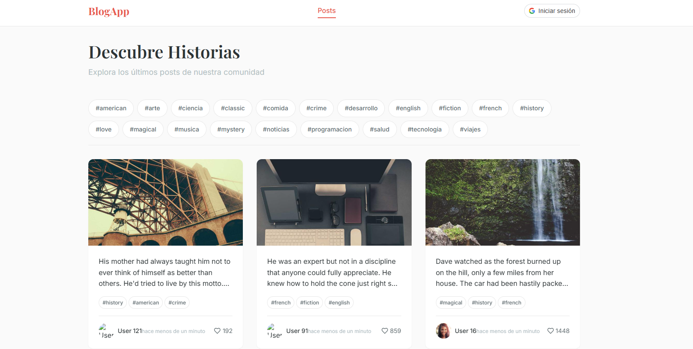

# Blog App



Un blog moderno construido con React, TypeScript, styled-components y Firebase Realtime Database.

## Características

- ✅ Ver posts con imagen principal, tags y usuario
- ✅ Modal de comentarios al hacer click en un post
- ✅ Filtrado de posts por tags
- ✅ Autenticación con Google Sign-In y persistencia de usuario con Firebase Realtime Database
- ✅ Vista protegida de usuarios (requiere login)
- ✅ Cache simple de imágenes para carga más rápida
- ✅ Instancia única de Axios con interceptores
- ✅ Persistencia de usuario con Firebase Realtime Database

## Estructura del Proyecto

```
src/
├── api/                 # Conexiones API y axios instance
├── components/          
│   ├── Comments/
│   ├── Header/
│   ├── Loader/
│   ├── Modal/
│   ├── Posts/
│   ├── Tags/
│   └── Users/
├── context/             # React Context providers
│   ├── auth/
│   ├── posts/
│   └── ui/
├── hooks/               # Custom hooks
├── interfaces/          # TypeScript interfaces
├── pages/               # Páginas de la app
│   ├── Home/
│   ├── Users/
│   └── NotFound/
├── router/              # Configuración de rutas
├── theme/               # Tema y estilos globales (styled-components para legacy, Tailwind para nuevo)
├── utils/               # Utilidades y helpers
└── firebase.ts          # Configuración de Firebase
```

## Instalación

1. Clona el repositorio
2. Instala las dependencias:
   ```bash
   npm install
   ```
3. Copia `example.env` a `.env` y configura las variables:
   ```bash
   cp example.env .env
   ```
4. Inicia el servidor de desarrollo:
   ```bash
   npm run dev
   ```

## Configuración

### DummyJSON API
1.  La aplicación consume la API pública de [DummyJSON](https://dummyjson.com/). No se requiere una App ID.

### Google Sign-In
1. Ve a [Google Cloud Console](https://console.cloud.google.com/)
2. Crea un proyecto y configura OAuth 2.0
3. Obtén tu Client ID
4. Agrégalo en `VITE_GOOGLE_CLIENT_ID` en tu archivo `.env`

### Firebase Realtime Database
1. Ve a [Firebase Console](https://console.firebase.google.com/)
2. Crea un proyecto o selecciona uno existente.
3. En la sección "Build", selecciona "Realtime Database" y crea una nueva base de datos.
4. Ve a "Project settings" (el icono de engranaje junto a "Project overview").
5. En la sección "Your apps", selecciona la aplicación web (o crea una nueva).
6. Copia el objeto `firebaseConfig` que se te proporciona.
7. Actualiza el archivo `src/firebase.ts` con tus credenciales de Firebase, asegurándote de reemplazar todos los marcadores de posición (especialmente `databaseURL`).

## Tecnologías

- React 18
- TypeScript
- Vite
- styled-components
- React Router DOM
- Axios
- @react-oauth/google
- Firebase Realtime Database

## API

La app consume la [DummyJSON API](https://dummyjson.com/docs):

- `GET /posts` - Lista de posts
- `GET /posts/{id}/comments` - Comentarios de un post
- `GET /users` - Lista de usuarios
- **Nota:** La API de DummyJSON no tiene endpoints directos para tags. Los tags se extraen de los posts y se gestionan en el cliente.